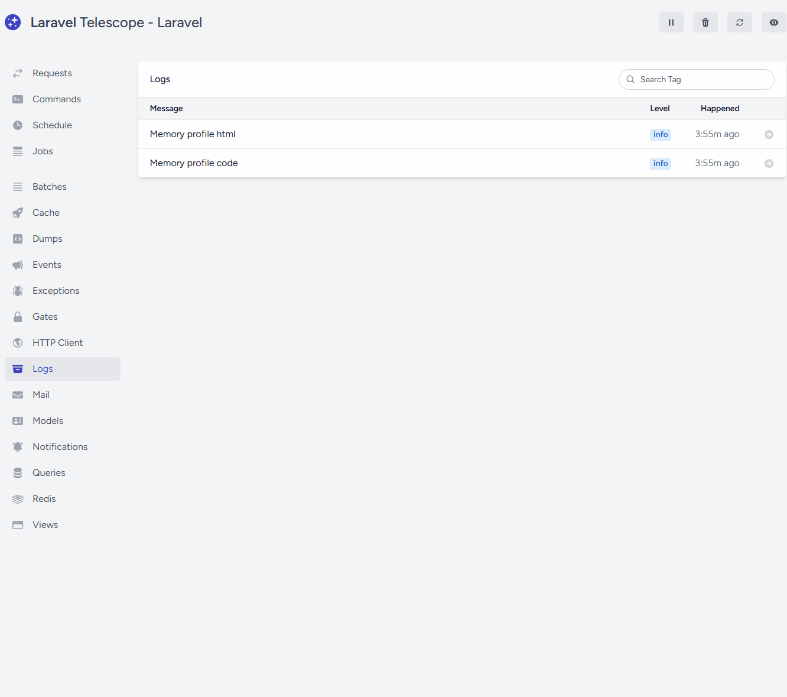

# Laravel Memory Profiler

> Measure **peak memory** and **execution time** in your Laravel app — for HTTP requests and Artisan commands. Ships with headers, logs, and optional Telescope integration.

[](https://packagist.org/packages/ov/laravel-profiler)
[](https://www.php.net/)


---

## Features

* 🔎 **Precise metrics**: duration (ms), start/end/peak memory and memory diff.
* 🌐 **HTTP profiling** via middleware + optional response headers: `X-Memory-Peak`, `X-Duration-ms`.
* 🧰 **Artisan profiling** via a simple trait wrapper.
* 🧱 **Manual spans** (start/stop) via the service or facade.
* 🪵 **Pluggable outputs**: app log, Laravel Telescope (or both).
* 🎚️ **Threshold**: only log when peak memory exceeds N bytes.

## Requirements

* PHP **>= 8.1**
* Laravel **10.x / 11.x / 12.x**

## Installation

```bash
composer require phpner/laravel-profiler
php artisan vendor:publish --tag=config --provider="Phpner\\MemoryProfiler\\MemoryProfilerServiceProvider"
```

This publishes `config/laravel-memory-profiler.php`.

## Quick start

### HTTP requests

Register the middleware (global or route group):

```php
// app/Http/Kernel.php
protected $middleware = [
    // ...
    \Phpner\MemoryProfiler\Middleware\HttpProfiler::class,
];
```

When enabled, each request will:

* write a log entry with metrics and request context;
* (optionally) add headers `X-Memory-Peak` and `X-Duration-ms` to the response.

### Artisan commands

Wrap your command logic with the provided trait:

```php
use Illuminate\Console\Command;
use Phpner\MemoryProfiler\Console\Concerns\ProfilesMemory;

class ImportUsers extends Command
{
    use ProfilesMemory;

    protected $signature = 'users:import';

    public function handle(): int
    {
        return $this->withMemoryProfiling(function () {
            // your command logic
            $this->info('Importing...');
            // ...
            return 0; // exit code
        });
    }
}
```

The profiler will log command name and exit code along with metrics.

### Manual spans

Use the service (DI) or the facade to measure any piece of code.

```php
use Phpner\MemoryProfiler\MemoryProfiler; // service
use Phpner\MemoryProfiler\Facades\MemoryProfiler as MP; // facade

// 1) Service
public function show(MemoryProfiler $profiler)
{
    $ctx = $profiler->start('code');
    // ... your code ...
    $profiler->stop($ctx, [
        'label' => 'users.show',
        'meta'  => ['id' => 42],
    ]);
}

// 2) Facade
$ctx = MP::start('code');
// expensive work
MP::stop($ctx, ['label' => 'expensive.segment']);
```

## Configuration

`config/laravel-memory-profiler.php`:

```php
return [
    'enabled'          => env('MEMORY_PROFILER_ENABLED', true),
    'driver'           => env('MEMORY_PROFILER_DRIVER', 'log'), // log | telescope | both
    'threshold'        => env('MEMORY_PROFILER_THRESHOLD', 0),  // bytes; 0 = log everything
    'response_headers' => env('MEMORY_PROFILER_HEADERS', true),
];
```

**Common .env options**

```dotenv
MEMORY_PROFILER_ENABLED=true
MEMORY_PROFILER_DRIVER=both     # log | telescope | both
MEMORY_PROFILER_THRESHOLD=0     # e.g. 2097152 (2 MB)
MEMORY_PROFILER_HEADERS=true
```

## Output

### Response headers (HTTP)

```
X-Memory-Peak: 1048576
X-Duration-ms: 123
```

### Log entry (example)

```json
{
  "duration_ms": 123,
  "memory_start": 524288,
  "memory_end": 786432,
  "memory_peak": 1048576,
  "memory_diff": 262144,
  "type": "http",          // or "artisan" / "code"
  "label": "users.show",   // when provided for manual spans
  "method": "GET",
  "path": "api/users/42",
  "route": "users.show",
  "status": 200
}
```

### Telescope (optional)

Set `MEMORY_PROFILER_DRIVER=telescope` or `both`. Entries appear in Telescope **Log** section with the `memory` tag.

## Why this package?

* Lightweight and framework-native.
* Zero vendor lock‑in: works with logs you already collect; Telescope is optional.
* Transparent: you decide where to profile (global, group, specific commands, or manual spans).

## Tips

* Start with `threshold=0` in dev to see everything; raise it in prod to reduce noise.
* Put the middleware only on routes you care about if you want a narrower focus.
* Pair with request IDs/correlation IDs in your logger to join app logs and memory profiles.

## Roadmap

* Queue job middleware.
* Blade/Laravel Debugbar-like panel.
* Per-route configuration overrides.

## Contributing

PRs and issues are welcome! Please include tests where it makes sense.

## License

Released under the **MIT** License.

---




